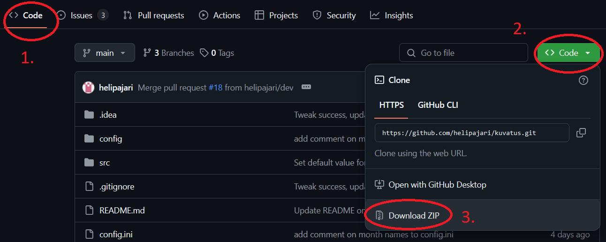
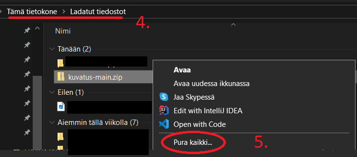
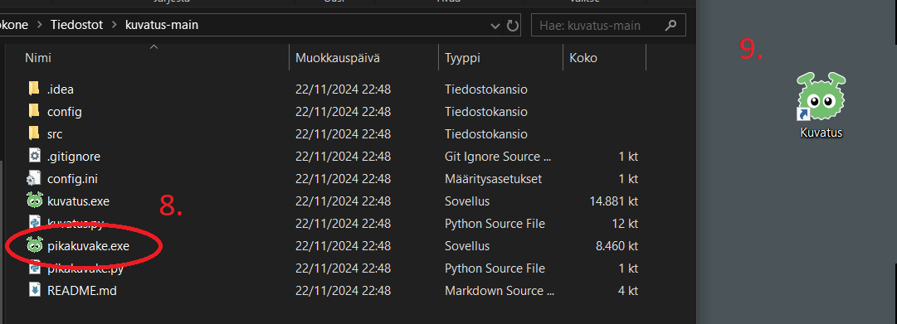

#  Kuvatus - tiedostojen arkistointityökalu
Kuvatus on ohjelma, jolla voi arkistoida (kuva)tiedostoja.
Se luo kohdekansiooon kansiorakenteen vuosille ja kuukausille 
arkistoitavien tiedostojen nimien perusteella.

Kuvatus ei poista jo olemassa olevia kansioita tai korvaa kohdekansiossa olevia tiedostoja.

Kuvatus siirtää tiedostot, joiden nimessä on:

- vähintään 6 numeroa (etsitty formaatti on vvvvkk)
- ensimmäiset 4 numeroa voivat olla mitä tahansa
- viides ja kuudes numero yhteenliitettynä ovat välillä 01-12

Muussa tapauksessa Kuvatus ohittaa tiedoston eikä tee sille mitään.

Esimerkkejä tiedostonimistä, jotka Kuvatus voi arkistoida:
- `20230102.jpg`
- `IMG_20240302.jpg`
- `WIN_20240102 Riikan kissat (harmaa ja musta).jpg`
- `1803 12 tarkka päivämäärä ei tiedossa.png`
- `2005-10-23 tekstitiedosto versio 2.txt`
- Huom: myös `CSE1105 video(10).mp4` arkistoituu, koska nimessä on 6 numeroa! 


---

## Sisältö
- [Käyttöesimerkki](#Käyttöesimerkki)
- [Asennusohje](#Asennusohje)
- [Käyttöohje](#Käyttöohje)
  - [Näppäimistökäyttöohje](#Näppäimistökäyttöohje)
- [Asetukset](#Asetukset)

---

### Käyttöesimerkki


```
Lähdekansio:
- 20230101.jpg
- 20230102.jpg
- 20230103.jpg
- 20230410.jpg
- 20240201.jpg
- 20240202.jpg 
```

```
(Tyhjä) kohdekansio tiedostosiirron jälkeen:

2023
    - 01 tammi
        - 20230101.jpg
        - 20230102.jpg
        - 20230103.jpg
    - 04 huhti
        - 20230410.jpg

2024
    - 02 helmi
        - 20240201.jpg
        - 20240202.jpg 
```
**HUOMIO!** 

Kuvatus ei etsi tiedostoja alakansioista, eli siirrettävien tiedostojen on oltava kaikkien samassa kansiossa kuten esim. kameran muistikortilla.

---
## Asennusohje
Vaihe 1/3 - Lähdekoodin lataaminen:
1. tarkista, että valittu välilehti GitHubissa on `Code`
2. valitse vihreä `Code`-valikko
3. valitse `Download ZIP`


Vaihe 2/3 - Lähdekoodipaketin purku:
4. avaa tietokoneen Ladatut tiedostot-kansio
5. avaa `kuvatus-main.zip`-tiedoston valikko hiiren kakkospainikkeella ja valitse `Pura kaikki...`
6. noudata purkuohjeita, valitse `Näytä lopuksi puretut tiedostot`
   1. tämä on Kuvatuksen asennuskansio



Vaihde 3/3 - Käyttöönotto:
7. kansiossa, johon `kuvatus-main.zip` purettiin edellisessä vaiheessa:
8. suorita pikakuvake-sovellus tuplaklikkaamalla sitä
   1. tämä luo työpöydälle pikakuvakkeen, jonka kautta Kuvatusta voi käyttää
   2. jos Windows Defender varoittaa tuntemattoman sovelluksen suorittamisesta,
    valitse `Lisätietoja` ja `Suorita joka tapauksessa` 
9. Kuvatus on valmis käytettäväksi!
   1. Windows Defender voi varoittaa tuntemattoman sovelluksen suorittamisesta, toimi kuten edellä
   2. Jos Kuvatus ei käynnisty, kokeile siirtää Kuvatuksen asennuskansio esimerkiksi Tiedostot-kansioon ja palaa ohjeen kohtaan 8
   


---

## Käyttöohje 
1. käynnistä Kuvatus työpöydän pikakuvakkeesta
2. tarkista lähde- ja kohdekansioiden sijainti, etsi tai muuta niitä tarvittaessa
   - lähdekansio on oletusarvona tietokoneen `D`-levy, joka läppäreitä käyttäessä on yleensä muistikortti
   - kohdekansio on oletusarvoisesti käyttäjän oma `Kuvat`-kansio
     - katso kohta [Asetukset](#Asetukset) näiden muokkaamiseksi
   2. **HUOM** kansiota etsiessä tai muutettaessa on valittava `Valitse kansio`, muuten muutos ei tule voimaan.
3. valitse, poistetaanko kuvat lähdekansiosta (tekstiä `Poistetaanko kuvat lähdekansiosta?` voi klikata hiirellä valinnan muuttamiseksi)
4. valitse, käytetäänkö kansioiden nimissä myös kuukausien nimiä numeroiden lisäksi (tekstiä `Käytä kuukausien nimiä kansiossa?` voi klikata hiirellä valinnan muuttamiseksi)
5. paina `OK`
6. siirto on valmis, kun ruutuun ilmestyy `Valmis!`-ikkuna. 
7. paina `Ok, sulje ohjelma`.

### Näppäimistökäyttöohje

Kuvatusta voi käyttää melkein kokonaan ilman hiirtä. Tällöin Kuvatus käynnistetään tavalliseen tapaan 
hiirellä. Hiirtä tarvitaan vain, jos kansiosijainteja pitää muuttaa.

- `Tab` : Siirry eteenpäin
- `Shift` ja `Tab` : Siirry taaksepäin
- `Välilyönti` : Valitse

---
## Asetukset
Kuvatus tallentaa valitut tiedostopolut ja käyttöasetukset automaattisesti asetustiedostoon `config.ini`, kun tiedostoja siirretään.

Jos `config.ini`-tiedostoa ei löydy, Kuvatus luo sellaisen oletusasetuksilla. 
Oletusasetuksina kuvien lähdekansio on D-levy, kohde käyttäjän Kuvat-kansio, 
kuvat poistetaan lähdekansiosta siirron jälkeen ja kansioissa käytetään kuukausien nimiä.


### Kuukausien nimet
Kuukausien nimiä voi vaihtaa muokkaamalla asetustiedostoa tekstieditorissa (esim. Muistio)
ja tallentamalla muutokset.

Tiedostopäätettä `ini` ei saa muuttaa.
